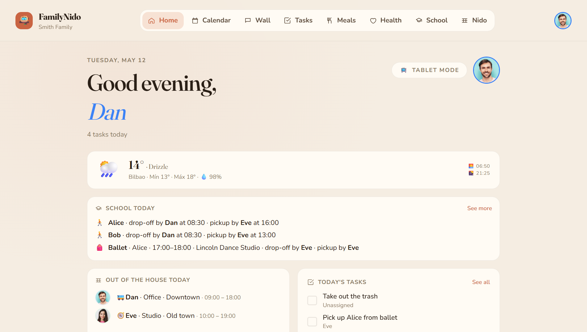
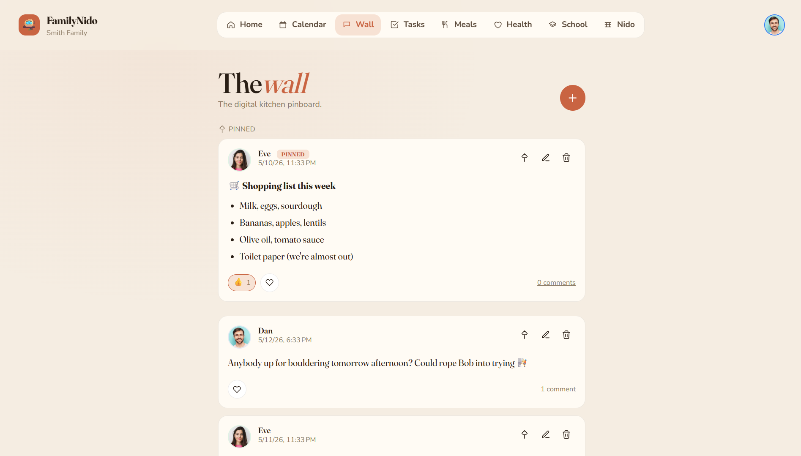
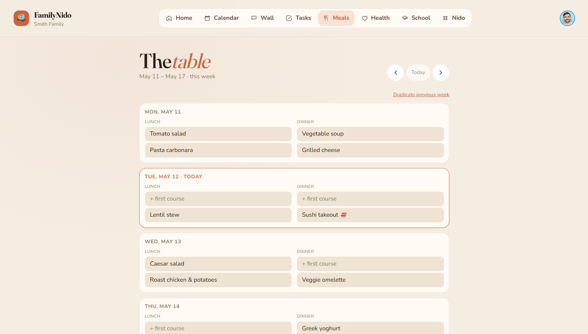
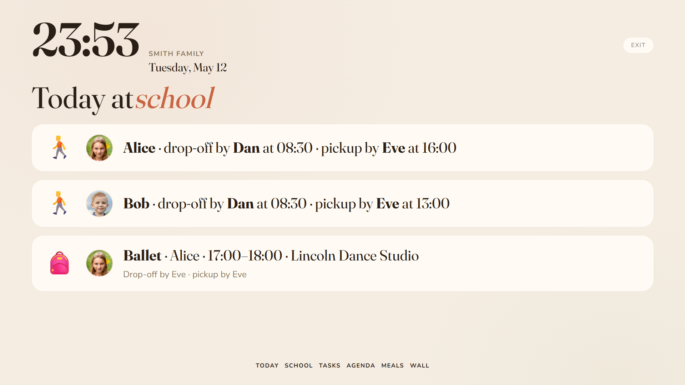

# 🏡 FamilyNido

> The digital nest for a single household — calendars, chores, meals, school,
> health and family conversations, all in one place. Self-hosted, ad-free,
> telemetry-free, one instance per family.

Built as a PWA you install on every phone, tablet and laptop in the house.
Designed to be deployed in ten minutes on any home server with `docker compose`.

> 🤖 **Pair-programmed end-to-end with [Claude Code](https://claude.com/claude-code)
> (Opus 4.7).** This repository is an experiment in how far a single developer
> can go shipping a real product side-by-side with an AI coding partner —
> architecture, vertical slices, tests, infra, docs and this very README.



---

## ✨ Highlights

- 🧩 **Modular by design** — each feature is an isolated Angular route on the
  frontend and a vertical slice on the backend; add, remove or extend without
  cross-cutting changes.
- 📱 **Installable PWA** — works on iPhone, Android and desktop; the manifest
  registers it as a native-feeling app on the home screen.
- 🔐 **Private** — your data lives on your hardware. Local credentials by
  default, OIDC (PocketID, Dex, Keycloak, Authelia…) optional.
- 🎮 **Gamified chores** — every completed task awards points; a per-period
  scoreboard makes contribution visible without nagging.
- 📅 **Bring-your-own-calendar** — read-only mirror of as many Google Calendar
  accounts as the family has (one-way: Google → FamilyNido).
- 📺 **Tablet mode** — a fullscreen rotating dashboard for the kitchen tablet
  stuck to the wall.
- 🔌 **Open public API** — drop tasks in from n8n, IFTTT, an iOS shortcut, a
  Home Assistant automation or `curl`.

---

## 📦 Modules

Flat list of everything FamilyNido ships with. Every module is opt-in: hide it
from the navigation if your family doesn't use it, or extend it by adding files
to its vertical slice.

### 📅 Calendar

The shared family calendar. Each event can be tagged to specific members so the
tablet on the wall only shows "today's stuff for *me*". Optional one-way mirror
of Google Calendar — link as many Google accounts as the family has, pick which
sub-calendars to import, and a background worker pulls fresh deltas every few
minutes. Edits made inside FamilyNido stay in FamilyNido; nothing is written
back to Google.

### 💬 Wall

The household's message board. Markdown-formatted posts with emoji reactions,
threaded comments, pin-to-top and per-user unread counts. Use it for the
running shopping list, *"remember to call grandma tomorrow"* or sharing the
photo of yesterday's school play.



### ✅ Tasks

The chore tracker. One-off and recurring household tasks (daily, weekly,
custom), a **Today** tab, a 7-day **Week** tab and a backlog of *floating*
tasks with no due date. Completing a task awards points to whoever ticked it
off; tasks can also be pre-assigned to a specific member.

### 🍽️ Meals

The weekly meal plan. Seven days × multiple slots (breakfast, lunch, snack,
dinner). Smart suggestions based on what the family has eaten recently to keep
variety up and decision fatigue down. One-click *"duplicate last week"* for
batch planners.



### 🩺 Health

Per-member health records. Medical profile (blood type, allergies, chronic
conditions), active medications with posology and vaccination history. So the
next pediatrician visit doesn't need a frantic search across three photo
libraries and four chat threads.

### 🎒 School

The kids' school agenda. Daily class schedule per member (with per-day
overrides for substitute teachers or field trips), school holidays and
extracurricular activities with recurring slots plus one-off exceptions. The
tablet's *"Cole"* page summarises tomorrow's gear list.

### 🏆 Scores

The gamification layer for tasks. Each completion earns points proportional to
the task's weight; the scoreboard ranks members for the current period. The
point of points: making contribution visible without anybody having to count
out loud.

### 🗓️ Member agenda

Per-member recurring patterns — *"Mum works Mon–Thu 9–18"*, *"Charlie has
gymnastics Tuesdays 18:00"*. Used by the dashboard widgets and the tablet to
answer *"who's where right now?"*. Patterns support exceptions (cancellations,
one-off swaps) without having to rewrite the rule.

### 🪺 Nido

The family roster. Admins add members (kids without accounts, adults with),
invite adults by email through single-use signed links, promote or demote
admins, upload member avatars and review pending invitations.

### 📺 Tablet mode

A fullscreen ambient dashboard meant for the kitchen tablet stuck to the wall.
Big typography, six rotating pages (Home, Cole, Tasks, Calendar, Meals, Wall),
auto-cycles every minute, refreshes every five and asks the browser to keep
the screen awake. Lives outside the regular nav so it doubles as an information
radiator.



### 🏠 Home dashboard

The landing screen every user opens to. Built from configurable widgets —
each user picks which ones they care about (today's events, pending tasks,
weather, scoreboard, school day…) and the order.

### 🌤️ Weather

A weather widget pinned to the family's configured location. Powered by
Open-Meteo (no API key, no ads, no tracking). Surfaces on the home dashboard
and the tablet.

### 🔔 Notifications

Daily email digests summarising what's pending plus per-event mails. Each user
toggles which categories they want from the account screen. Push notifications
via VAPID for browsers that support them.

### 🔑 Account

Personal settings — change password, switch UI language (🇪🇸 Spanish /
🇬🇧 English), tweak notification preferences, see and revoke linked
credentials.

### 🔌 Integrations

A versioned public API at `/api/v1/**` authenticated by per-family API keys
(`X-Api-Key` header). First endpoint shipped: `POST /api/v1/tasks`. Wire it to
n8n, IFTTT, iOS shortcuts, Home Assistant or your own scripts. See
[`docs/integrations/README.md`](./docs/integrations/README.md) for the full
reference.

---

## 🧱 Stack

| Layer    | Technology                                                       |
| -------- | ---------------------------------------------------------------- |
| Frontend | Angular 21 (standalone, signals, zoneless) + Tailwind CSS v4     |
| Backend  | .NET 10 (ASP.NET Core Minimal APIs) + EF Core 10                 |
| Database | PostgreSQL 16                                                    |
| Auth     | Local credentials by default · optional OIDC (PocketID, Dex, …)  |
| Realtime | SignalR                                                          |
| Deploy   | Docker Compose + external Traefik                                |

---

## 📁 Repository layout

```
FamilyNido/
├── src/
│   ├── FamilyNido.Api/           # ASP.NET Core Minimal APIs, SignalR hub, vertical slices
│   ├── FamilyNido.Domain/        # Aggregates, value objects, pure domain rules
│   └── FamilyNido.Persistence/   # EF Core DbContext, EntityTypeConfigurations, migrations
├── tests/
│   └── FamilyNido.Tests/         # xUnit + Testcontainers integration suite
├── web/
│   └── familynido-web/           # Angular app (Tailwind v4, Fraunces/Nunito)
├── deploy/
│   ├── docker-compose.prod.yml   # Production stack — pulls images from GHCR
│   ├── docker-compose.dev.yml    # Development stack — Postgres only
│   ├── api.Dockerfile
│   ├── web.Dockerfile
│   ├── nginx/default.conf
│   └── .env.example
└── docs/
    └── integrations/             # Public API reference for external integrations
```

---

## 🛠️ Local requirements

- **.NET 10 SDK** (`dotnet --version` ≥ 10.0)
- **Node.js 22+** and **npm 10+**
- **Docker 28+** with Compose v2
- *(optional)* PostgreSQL 16 if you prefer not to use the Docker database

---

## 🚀 Development

### 1. Start the dev infrastructure

```bash
docker compose -f deploy/docker-compose.dev.yml up -d
```

Brings up **PostgreSQL 16** on `localhost:5435`
(db / user / password: `familynido` / `familynido` / `familynido`).

The dev stack authenticates exclusively against local credentials
(`POST /api/auth/local/login`). The login screen hides the *"Continue with
PocketID"* button when `Oidc:Authority` is empty — the default in
`appsettings.Development.json`. To test the OIDC flow locally, fill in
`Oidc:Authority`, `Oidc:ClientId` and `Oidc:ClientSecret` and the button
reappears on the next page load.

### 2. Backend

```bash
cd src/FamilyNido.Api
dotnet watch run
```

Listens on `http://localhost:5080`. Applies EF Core migrations on startup.

### 3. Frontend

```bash
cd web/familynido-web
npm install
npm start
```

Listens on `http://localhost:4200`. `/api` requests are proxied to the backend
via `proxy.conf.json`.

### 4. *(optional)* Seed a curated demo family

If you want to explore the UI without going through the onboarding flow, the
API ships a **demo seed** that drops a fictitious *Smith Family* (two adults,
two kids) with tasks, wall posts, a populated meal plan and a school
schedule. Off by default — flip `Seed:Demo:Enabled` and provide a password to
turn it on:

```bash
cd src/FamilyNido.Api
Seed__Demo__Enabled=true \
Seed__Demo__AdminPassword=DemoPass123! \
dotnet watch run
```

Log in as `dan@familynido.demo` with the password you set. The seed is
**Development-only** (never registered in `Testing` or `Production`) and is
idempotent — if the family already exists, the seeder no-ops. To reset, wipe
the dev volume (`docker compose -f deploy/docker-compose.dev.yml down -v`)
and start over.

---

## 🧪 Testing

### Unit + integration tests (xUnit + Testcontainers)

```bash
dotnet test
```

The suite spins up a throwaway Postgres container per fixture, so the only
requirement is a running Docker daemon. ~100 tests, around 30 seconds.

<details>
<summary><strong>End-to-end tests (Playwright)</strong> — click to expand</summary>

Specs live in `web/familynido-web/e2e/` and drive a full stack (API + Postgres
+ nginx). To run them locally:

1. **Seed the two test users.** The API ships an `E2ETestDataSeeder` that only
   kicks in when the environment is `Testing` and the flag `Seed:E2E:Enabled`
   is set. Start the API like this:

   ```bash
   cd src/FamilyNido.Api
   ASPNETCORE_ENVIRONMENT=Testing \
   Seed__E2E__Enabled=true \
   Seed__E2E__UserAPassword=SuperSecret123! \
   Seed__E2E__UserBPassword=SuperSecret123! \
   dotnet run
   ```

   This creates the `FamilyNido E2E` family with tester A (admin) and tester B
   idempotently. The seed lives in its own family row so it never collides
   with real data.

2. **Serve the SPA behind nginx** — the specs target port `:5173` by default
   because `ng serve` doesn't understand the `/es` and `/en` subpaths produced
   by the i18n build.

3. **Run Playwright**:

   ```bash
   cd web/familynido-web
   E2E_BASE_URL=http://localhost:5173 \
   E2E_USER_EMAIL=e2e-a@familynido.test \
   E2E_USER_PASSWORD=SuperSecret123! \
   E2E_USER_B_EMAIL=e2e-b@familynido.test \
   E2E_USER_B_PASSWORD=SuperSecret123! \
   npm run e2e
   ```

   `npm run e2e:ui` opens Playwright's time-travel UI for debugging.

In CI, `.github/workflows/e2e.yml` boots the full stack automatically and
uploads traces as an artifact whenever a spec fails.

</details>

---

## 🚢 Deployment

```bash
cp deploy/.env.example deploy/.env
# Edit deploy/.env with real values (OIDC, Postgres, VAPID, SMTP, …)
docker compose -f deploy/docker-compose.prod.yml up -d
```

The containers (`familynido-api`, `familynido-web`, `familynido-db`) ship with
Traefik labels so an external Traefik instance can expose them through your
configured `TRAEFIK_HOST`. Refer to [`deploy/README.md`](./deploy/README.md)
for first-time server setup, Google Calendar OAuth wiring and rollback
procedure.

---

## 🔒 Security

Reports of vulnerabilities go through GitHub's *Report a vulnerability* button
on the **Security** tab — never as a public issue. Full policy and threat
model in [`SECURITY.md`](./SECURITY.md).

---

## 📄 License

MIT — see [`LICENSE`](./LICENSE).
